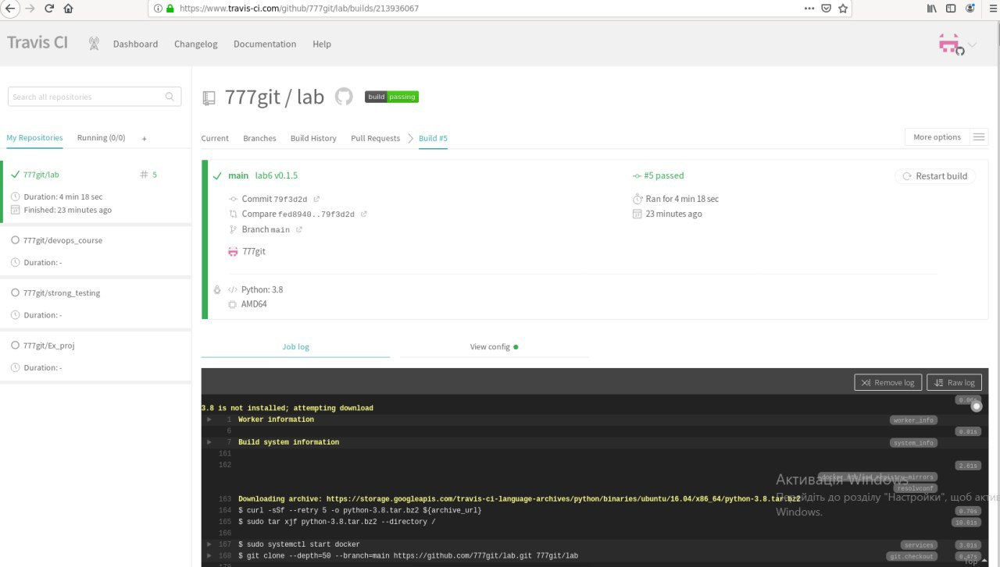
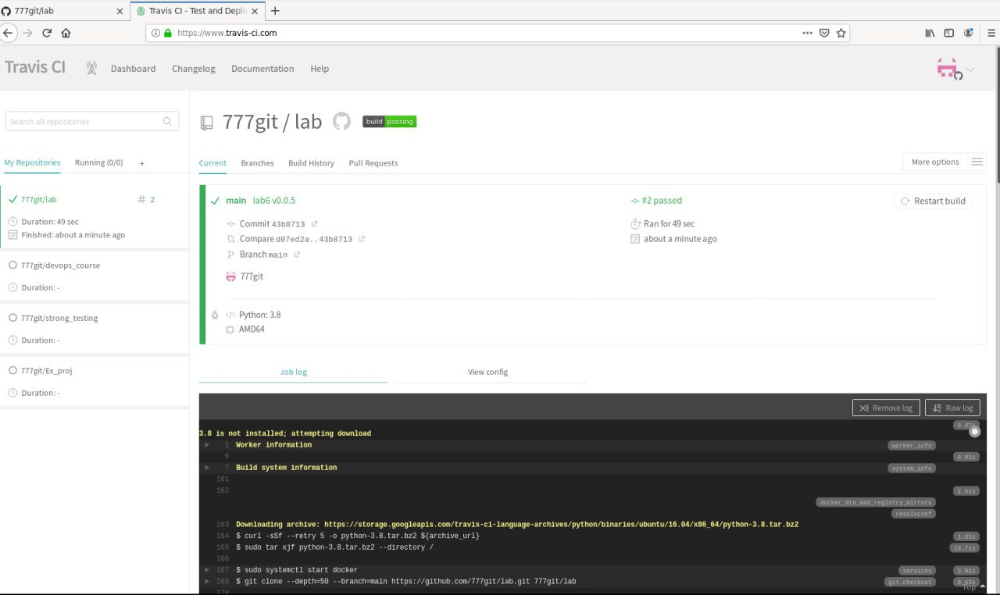
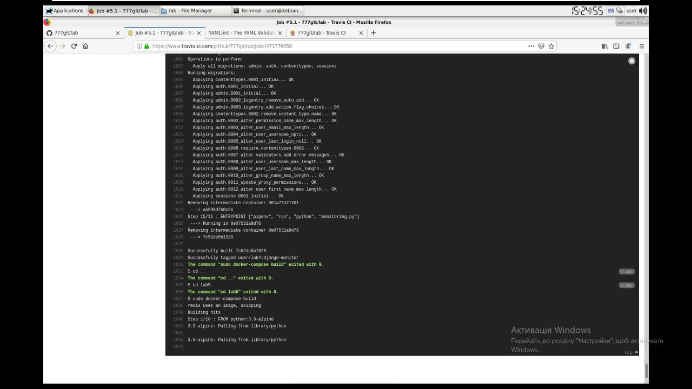

## 1-4
### Авторизувався в Travis CI створив .travis.yml
## 6
### Переписав білд для lab_2

### Використавши docker compose збілдив необхідні контейнери

### make збілдив все необхідне із лаби 5

### https://www.travis-ci.com/github/777git/lab
### lab6 виконана
